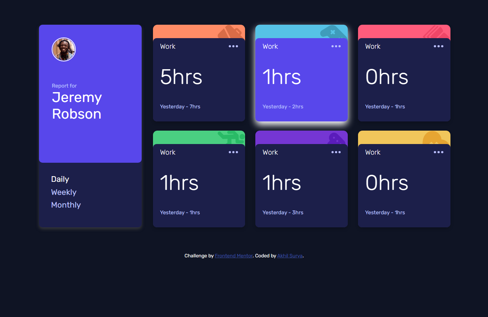

# Frontend Mentor - Time tracking dashboard solution

This is a solution to the [Time tracking dashboard challenge on Frontend Mentor](https://www.frontendmentor.io/challenges/time-tracking-dashboard-UIQ7167Jw). Frontend Mentor challenges help you improve your coding skills by building realistic projects. 

## Table of contents

- [Overview](#overview)
  - [The challenge](#the-challenge)
  - [Screenshot](#screenshot)
  - [Links](#links)
- [My process](#my-process)
  - [Built with](#built-with)
  - [What I learned](#what-i-learned)
  - [Continued development](#continued-development)
  - [Useful resources](#useful-resources)
- [Author](#author)
- [Acknowledgments](#acknowledgments)

**Note: Delete this note and update the table of contents based on what sections you keep.**

## Overview

### The challenge

Users should be able to:

- View the optimal layout for the site depending on their device's screen size
- See hover states for all interactive elements on the page
- Switch between viewing Daily, Weekly, and Monthly stats

### Screenshot



### Links

- Solution URL: [](https://github.com/AkhilsuryaA/fmtt-dashboard-challenge)
- Live Site URL: [](https://akhilsuryaa.github.io/fmtt-dashboard-challenge/)

## My process

### Built with

- Semantic HTML5 markup
- CSS custom properties
- Flexbox
- CSS Grid
- Mobile-first workflow
- Google Fonts

### What I learned

```html
<h1>Some HTML code I'm proud of</h1>

        <div class="user card ">
          <div class="card-top">
            <div class="title-img">
```
```css
.proud-of-this-css {
    background-color: hsl(246, 80%, 60%);
      height: 55%;
      padding: 3%;
      border-radius: 8px;
      display: flex;}
```
```js
const proudOfThisFunc = () => {
function changeValues(state) {}
}
```

### Continued development

working on margins and layouts are something I should work on

### Useful resources

- [w3schools](https://www.w3schools.com/) - This helped me with layouts and css and js
- [stackoverflow](https://stackoverflow.com) - They continues to help me on various occassions.

## Author

- Website - [Akhil Surya A](https://www.your-site.com)
- Frontend Mentor - [@AkhilsuryaA](https://www.frontendmentor.io/profile/AkhilsuryaA)
- Twitter - [@iam_suryan](https://www.twitter.com/iam_suryan)

## Acknowledgments

- Frontend Mentor - [@AlanSugito](https://www.frontendmentor.io/profile/AlanSugito)
His solution was an inspiration for me to work on this project.
